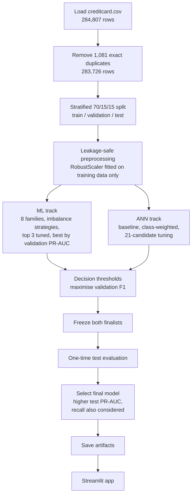

# Credit card fraud detection: machine learning vs deep learning

A comparison of eight machine learning (ML) model families and an artificial neural network (ANN) for detecting fraudulent credit card transactions in a highly imbalanced dataset, with the selected model served in an interactive Streamlit app.

---

## Project objective

Detect as many fraudulent credit card transactions as possible while keeping false alarms in view.

- **Primary development metric:** average precision (AP), reported in this project as PR-AUC, which summarises performance across the precision–recall trade-off at all thresholds. It is used to compare and tune models.
- **Deployment focus:** recall is given greater importance when interpreting the final deployment choice; precision and false alarms are also considered.
- **Why not accuracy:** only about 0.17% of transactions are fraud, so a model that always predicts "not fraud" reaches 99.83% accuracy while detecting no fraud at all.

## Dataset

- **Source:** [Credit Card Cheating Detection (CCCD) on Kaggle](https://www.kaggle.com/datasets/arslanali4343/credit-card-cheating-detection-cccd)
- **Scope:** transactions made by European cardholders over two days in September 2013.
- **Size:** 284,807 transactions and 31 columns, with 492 frauds (0.173%) and no missing values.
- **Features:**
  - `Time`: seconds elapsed since the first transaction in the dataset
  - `V1`–`V28`: anonymised principal components (PCA); their original meaning is not available
  - `Amount`: transaction amount
- **Target:** `Class` (1 = fraud, 0 = not fraud)
- **Cleaning:** 1,081 exact duplicate rows (1,062 non-fraud, 19 fraud) were removed before splitting, leaving 283,726 transactions with 473 frauds (0.167%). No duplicate had conflicting labels.

## Prerequisites

1. Download the dataset from the [Kaggle link](https://www.kaggle.com/datasets/arslanali4343/credit-card-cheating-detection-cccd).
2. Place it in the project root folder `Credit_card_fraud_detection/` as `creditcard.csv` before running `code.ipynb`; the notebook loads the file by that name.

`creditcard.csv` is not included in this repository. The file is about 98 MiB (102.9 MB), above GitHub's 25 MiB limit for browser uploads and close to its 100 MiB per-file limit. The Streamlit app does not require `creditcard.csv`: inference and performance data come from the saved files in `artifacts/`, and the static banner is loaded from `assets/`.

## Project requirements vs delivered

| Requirement | Delivered |
|---|---|
| Compare ML models | 8 ML model families compared with 5-fold stratified cross-validation (CV), with class weighting, undersampling and SMOTE tested (notebook Steps 9–12) |
| Compare DL models (ANN) | Baseline, class-weighted and tuned ANNs built with TensorFlow/Keras (Steps 15–18) |
| Hyperparameter tuning for ML | `GridSearchCV` (KNN) and `RandomizedSearchCV` (XGBoost + SMOTE, Random Forest + SMOTE), scored by average precision (Step 13) |
| Hyperparameter tuning for DL | Randomised search over 21 ANN configurations: hidden layers, dropout, learning rate, batch size and fraud class weight (Step 17) |
| Metrics suitable for imbalanced data | PR-AUC, precision, recall, F1, ROC-AUC and confusion matrices; accuracy reported for reference only (Step 8 onwards) |
| Chart comparing ML and DL, with best model selection | Development overview chart and test-set comparison charts of the two finalists; the final model is selected by the predefined primary-metric rule (higher test PR-AUC) and also has the higher recall (Step 22) |
| Streamlit UI using the selected model | `app.py` serves the tuned ANN with its saved scaler and frozen decision threshold |

## How it works



- **Split:** 198,608 training, 42,559 validation and 42,559 test transactions, with 331, 71 and 71 frauds respectively. The fraud rate is the same in every set because the split is stratified on `Class`.
- **Leakage control:** scaling and resampling are fitted inside each training fold or on the training set only. The validation set is used for model selection, ANN early stopping and threshold tuning. The test set is used once, for the final comparison.
- **Scaling:** RobustScaler (median and IQR) is used for scale-sensitive models. A single extreme `V3` value raises that feature's training standard deviation about 6.4 times, which would distort a mean-and-standard-deviation scaler. Tree models and Gaussian Naive Bayes are not scaled.

## Models and tuning

### ML models

Eight families were evaluated with 5-fold stratified CV on the training data: Logistic Regression, Decision Tree, Random Forest, KNN, Linear SVM, Gaussian Naive Bayes, HistGradientBoosting and XGBoost. Each family was run at baseline and, where supported, with class weighting.

KNN and Gaussian Naive Bayes have no class-weighted version because their scikit-learn implementations do not provide a `class_weight` parameter.

| ML family | Best strategy | Mean CV PR-AUC (± std) |
|---|---|---|
| XGBoost | Class-weighted | 0.851 ± 0.035 |
| Random Forest | Baseline | 0.836 ± 0.033 |
| KNN | Baseline | 0.771 ± 0.042 |
| Logistic Regression | Baseline | 0.758 ± 0.041 |
| Linear SVM | Baseline | 0.753 ± 0.052 |
| HistGradientBoosting | Class-weighted | 0.744 ± 0.044 |
| Decision Tree | Baseline | 0.593 ± 0.091 |
| Gaussian Naive Bayes | Baseline | 0.177 ± 0.016 |

The top 3 families were then tested with random undersampling and SMOTE, applied inside each training fold only. Undersampling gave the lowest PR-AUC for all three. The best configurations were then tuned:

| Configuration | Search | Best settings | CV PR-AUC (untuned → tuned) | Validation PR-AUC |
|---|---|---|---|---|
| Random Forest + SMOTE | `RandomizedSearchCV`, 8 of 54 combinations | SMOTE ratio 0.1, 100 trees, max depth 20, min samples per leaf 5 | 0.849 → 0.854 | **0.844** |
| XGBoost + SMOTE | `RandomizedSearchCV`, 20 of 432 combinations | SMOTE ratio 0.1, 200 trees, max depth 6, learning rate 0.2, subsample 1.0, column sample 0.8 | 0.853 → 0.860 | 0.820 |
| KNN | `GridSearchCV`, 10 combinations | k = 15, distance weighting | 0.771 → 0.797 | 0.746 |

**Random Forest + SMOTE** had the highest validation PR-AUC and became the ML finalist.

### ANN

- **Baseline:** two hidden layers (32 and 16 units, ReLU), sigmoid output, Adam (learning rate 0.001), binary cross-entropy, batch size 2048, up to 100 epochs with early stopping on validation PR-AUC (patience 5, best weights restored). Validation PR-AUC: 0.829.
- **Class-weighted:** fully balanced class weights (fraud weight about 300). Validation PR-AUC fell to 0.682, and false alarms at the 0.5 cut-off rose from 3 to 1,084.
- **Tuned:** a randomised search over 96 possible combinations of hidden layers ((16, 8), (32, 16), (64, 32), (64, 32, 16)), dropout (0, 0.2), learning rate (0.001, 0.0005), batch size (1024, 2048) and fraud class weight (1, 5, 25). It evaluated 21 candidates: the baseline plus 20 sampled at random.
- **Best (Candidate 16):** hidden layers 32 and 16, dropout 0.2, learning rate 0.001, batch size 1024, no class weighting. Validation PR-AUC 0.838; training PR-AUC 0.893.

## Model selection and decision threshold

1. **ML finalist:** highest validation PR-AUC among the tuned ML configurations (Random Forest + SMOTE, 0.844).
2. **DL finalist:** highest validation PR-AUC among the ANN variants (tuned ANN, 0.838).
3. **Decision thresholds:** chosen for each finalist by maximising F1 on the validation set, because no business cost ratio, target recall or acceptable false-positive rate was defined. Random Forest: 0.7549. ANN: 0.3364.
4. **Freeze:** both finalists, with their scalers, hyperparameters and thresholds, were recorded and checked before the test set was used.
5. **Final selection:** the frozen finalists are evaluated once on the test set, and the finalist with the higher test PR-AUC (the predefined primary metric) is selected. Recall, precision and false alarms are reported alongside it to show the practical trade-off.

## Results: ML vs DL

Test set: 42,559 transactions, 71 frauds. Each model is evaluated at its frozen threshold.

| Metric | Tuned ANN (deployed) | Random Forest + SMOTE |
|---|---|---|
| PR-AUC | **0.8149** | 0.8100 |
| Precision | 0.8209 | **0.9444** |
| Recall | **0.7746** | 0.7183 |
| F1 | 0.7971 | **0.8160** |
| ROC-AUC | 0.9669 | **0.9745** |
| Accuracy | 0.9993 | 0.9995 |
| Frauds caught | **55 of 71** | 51 of 71 |
| Frauds missed | 16 | 20 |
| False alarms | 12 | **3** |
| Confusion matrix `[[TN, FP], [FN, TP]]` | `[[42476, 12], [16, 55]]` | `[[42485, 3], [20, 51]]` |

- **Selected model:** the tuned ANN. Under the predefined primary-metric rule, it has the higher test PR-AUC. It also has the higher recall, catching 4 more frauds, which matches the objective of detecting as many fraudulent transactions as possible.
- **Trade-off:** the ANN raises 9 more false alarms than Random Forest (12 vs 3). Random Forest is ahead on precision, F1 and ROC-AUC.
- **Scope:** the PR-AUC difference is 0.005, and the test set contains 71 frauds. The result applies to this test set and does not show that deep learning is generally better than machine learning for this problem.
- **Validation vs test:** both finalists had lower PR-AUC on the test set than on validation (Random Forest 0.844 → 0.810, ANN 0.838 → 0.815). Validation performance may be somewhat optimistic because the validation set was reused for model selection and ANN early stopping and tuning; sampling variability from the small number of fraud cases can also contribute.

## Streamlit app

**App link:** [Streamlit link](https://credit-card-fraud-detection-ai-mldl.streamlit.app/)

The app uses the deployed tuned ANN. Every prediction follows the same path: the 30 features are put into the training order, scaled with the saved RobustScaler, and scored by the ANN. A transaction is predicted as fraud when its score is at or above the frozen threshold of 0.3364. The output is called a **fraud score** because it is not a calibrated probability. Inference and performance data come only from the saved files in `artifacts/`, and the static banner is loaded from `assets/`; the app does not retrain the model or read `creditcard.csv`.

### Tabs: inputs and outputs

| Tab | Input | Output |
|---|---|---|
| **Fraud Detection** | Select one of 50 demo transactions and click **Predict Fraud**. Optionally edit any of the 30 feature values under **Advanced manual entry** and click **Predict manual transaction**. | A result card ("Potential fraud detected" or "No fraud detected") with the fraud score, threshold and prediction. Demo transactions also show the actual class and the outcome: fraud caught, fraud missed, false alarm or correctly cleared. Edited values show no actual class. **View transaction features** lists the 30 inputs. |
| **Batch Analysis** | Choose **Use demo CSV** and click **Analyse demo transactions**, or **Upload CSV** with the columns `Time`, `V1`–`V28` and `Amount` in any order, plus an optional `Class` column (0 or 1). | Summary cards (transactions analysed, predicted fraud and not fraud; with `Class`: correctly classified, actual frauds, fraud caught, fraud missed, false alarms), a results table and a **Download predictions CSV** button. `Class` is used only for comparison and is never passed to the model. Files are rejected with a message if they are empty, have missing or extra columns, or contain non-numeric, missing or infinite values, or `Class` values other than 0 and 1. |
| **Model Performance** | None | Why the model was selected; three test-set charts (metrics, precision–recall curves with each operating point, fraud caught/missed/false alarms), each with a short explanation; a comparison table; notes on accuracy, the decision threshold and feature interpretation; and a list of dataset and model limitations. |

### Demo data

The 50 demo transactions (`artifacts/test_sample.csv`) are taken only from the test set: 10 fraud and 40 non-fraud. The sample is deliberately enriched with fraud cases for demonstration and does not represent the dataset's natural fraud rate. On this sample the model flags 5 of the 10 frauds and clears all 40 non-fraud transactions (45 of 50 correct).

### Test scenarios

| Scenario | Where | Fraud score | Expected result |
|---|---|---|---|
| Fraud caught | Fraud Detection → Demo Transaction 14 | 0.9801 | Potential fraud detected; actual class Fraud (true positive) |
| Fraud caught | Fraud Detection → Demo Transaction 46 | 0.9704 | Potential fraud detected; actual class Fraud (true positive) |
| Fraud caught | Fraud Detection → Demo Transaction 30 | 0.8700 | Potential fraud detected; actual class Fraud (true positive) |
| Not fraud | Fraud Detection → Demo Transaction 2 | 0.0000 | No fraud detected; actual class Not fraud (true negative) |
| Fraud missed | Fraud Detection → Demo Transaction 15 | 0.0276 | No fraud detected, but the actual class is Fraud (false negative) |
| Whole demo batch | Batch Analysis → Use demo CSV → Analyse demo transactions | — | 50 analysed, 5 fraud caught, 5 fraud missed, 0 false alarms, 45 / 50 correctly classified |

The 10 demo frauds are Demo Transactions 12, 14, 15, 16, 21, 26, 30, 34, 36 and 46. Transactions 14, 21, 30, 36 and 46 are caught; the other five are missed with fraud scores between 0.0000 and 0.0276.

## Validation and reproducibility

- **Fixed seed:** `RANDOM_STATE = 42` is used for splitting, resampling, model training and the demo sample; the TensorFlow seed is reset before each ANN is built.
- **Pinned versions:** all packages are pinned in `requirements.txt`.
- **Checks built into the notebook:**
  - Step 18: the stored ANN reproduces its validation PR-AUC (0.8380).
  - Step 20: both frozen finalists reproduce their validation PR-AUC and confusion matrices before the test set is used.
  - Step 23: the recorded deployment configuration (feature order → scaler → ANN → threshold) reproduces the test results exactly.
  - Step 25: the saved model, scaler and metadata, reloaded from disk, reproduce the test results exactly (PR-AUC 0.8149, confusion matrix `[[42476, 12], [16, 55]]`).

## Project structure

```text
Credit_card_fraud_detection/
├── README.md
├── app.py                              # Streamlit app
├── code.ipynb                          # Full analysis: Steps 1–25
├── requirements.txt                    # Pinned package versions
├── .streamlit/
│   └── config.toml                     # App theme
├── artifacts/
│   ├── fraud_ann.keras                 # Deployed tuned ANN
│   ├── ann_scaler.joblib               # RobustScaler fitted on the training data
│   ├── deployment_metadata.json        # Deployment settings and test results of the tuned ANN
│   ├── final_comparison.csv            # Validation and test metrics of both finalists
│   ├── test_pr_curves.csv              # Test precision–recall curve points of both finalists
│   └── test_sample.csv                 # 50 demo transactions from the test set
└── assets/
    └── Credit_card_fraud_detection.png # Banner image
```

`creditcard.csv` is not part of the repository. Place it in `Credit_card_fraud_detection/` before running `code.ipynb` (see [Prerequisites](#prerequisites)).

## Technology stack

| Technology | Version | Role |
|---|---|---|
| Python | 3.12 | Programming language |
| pandas | 3.0.6 | Data loading and manipulation |
| NumPy | 1.26.4 | Numerical computation |
| scikit-learn | 1.9.1 | ML models, pipelines, RobustScaler, cross-validation, `GridSearchCV`, `RandomizedSearchCV`, `ParameterSampler`, metrics |
| imbalanced-learn | 0.14.2 | SMOTE, random undersampling and resampling pipelines |
| XGBoost | 3.4.1 | Gradient-boosted tree models |
| TensorFlow | 2.16.2 | ANN training and inference |
| Keras | 3.15.1 | ANN definition, early stopping, saving and loading (`.keras`) |
| Matplotlib | 3.11.2 | Charts in the notebook and the app |
| seaborn | 0.13.2 | Exploratory charts in the notebook |
| joblib | 1.6.0 | Saving and loading the fitted scaler |
| Streamlit | 1.60.0 | Interactive web app |
| ipykernel | 7.4.0 | Jupyter kernel for running the notebook |

## Assumptions

- `Time` is kept as a raw numeric feature; no time-series modelling is used.
- `V1`–`V28` are used as provided; no business meaning is assigned to them, and no features were engineered or removed.
- Exact duplicate rows are treated as duplicates and removed before splitting, so identical transactions cannot appear in more than one set.
- 48 rows with exact whole-number PCA values (including `V3 = 4232` and `V9 = 1221`, all non-fraud) are kept, because it cannot be established whether they are errors.
- The decision threshold maximises validation F1, because no business cost ratio, target recall or acceptable false-positive rate was defined.

## Known limitations

- The validation and test sets each contain only 71 frauds, so small performance differences should be interpreted cautiously.
- The validation set was reused for model selection and ANN early stopping and tuning, so validation performance may be optimistic. Threshold-dependent validation metrics may also be optimistic because the decision threshold was selected on the same validation set.
- The F1-based threshold gives a balanced precision–recall operating point; it does not maximise recall.
- `Time` is measured from the first transaction in this dataset and has no meaning outside it.
- `V1`–`V28` are anonymised PCA components, so individual features cannot be interpreted in business terms.
- Duplicate rows were removed without transaction IDs to confirm whether they were errors or genuine repeated transactions.
- 48 rows with unusual whole-number PCA values were kept because their validity could not be established.
- The data covers two days of European cardholder transactions from September 2013, so results may not carry over to other periods or populations.

## Future enhancements

- Choose the decision threshold from a defined business cost ratio or target recall instead of validation F1.
- Calibrate the fraud scores so they can be read as probabilities.
- Evaluate on larger and more recent data with more fraud cases, including validation over later time periods.
- Assess the ANN with repeated splits or cross-validation instead of a single validation set.
- Use a properly defined time feature, such as time of day, if real transaction timestamps are available.
